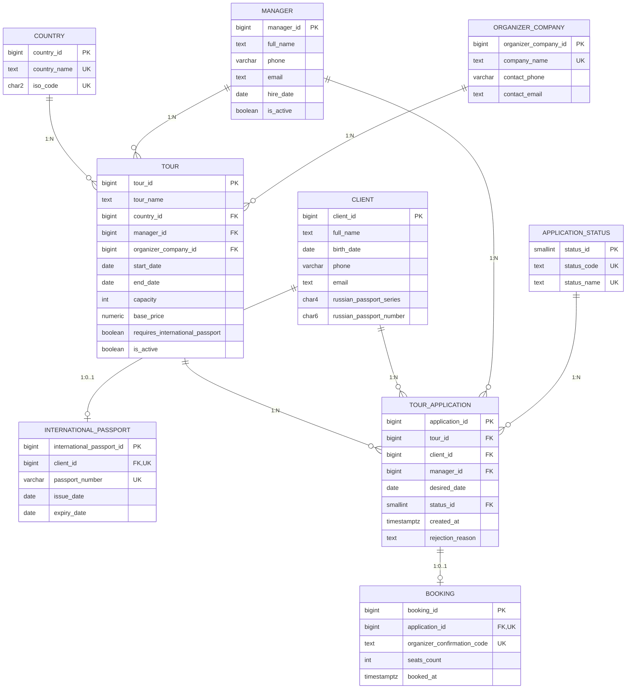

# ER-диаграмма (логическая модель данных)

```mermaid
erDiagram
    COUNTRY ||--o{ TOUR : "1:N"
    MANAGER ||--o{ TOUR : "1:N"
    ORGANIZER_COMPANY ||--o{ TOUR : "1:N"
    CLIENT ||--o| INTERNATIONAL_PASSPORT : "1:0..1"
    TOUR ||--o{ TOUR_APPLICATION : "1:N"
    CLIENT ||--o{ TOUR_APPLICATION : "1:N"
    MANAGER ||--o{ TOUR_APPLICATION : "1:N"
    APPLICATION_STATUS ||--o{ TOUR_APPLICATION : "1:N"
    TOUR_APPLICATION ||--o| BOOKING : "1:0..1"

    COUNTRY {
        bigint country_id PK
        text country_name UK
        char2 iso_code UK
    }

    MANAGER {
        bigint manager_id PK
        text full_name
        varchar phone
        text email
        date hire_date
        boolean is_active
    }

    ORGANIZER_COMPANY {
        bigint organizer_company_id PK
        text company_name UK
        varchar contact_phone
        text contact_email
    }

    TOUR {
        bigint tour_id PK
        text tour_name
        bigint country_id FK
        bigint manager_id FK
        bigint organizer_company_id FK
        date start_date
        date end_date
        int capacity
        numeric base_price
        boolean requires_international_passport
        boolean is_active
    }

    CLIENT {
        bigint client_id PK
        text full_name
        date birth_date
        varchar phone
        text email
        char4 russian_passport_series
        char6 russian_passport_number
    }

    INTERNATIONAL_PASSPORT {
        bigint international_passport_id PK
        bigint client_id FK,UK
        varchar passport_number UK
        date issue_date
        date expiry_date
    }

    APPLICATION_STATUS {
        smallint status_id PK
        text status_code UK
        text status_name UK
    }

    TOUR_APPLICATION {
        bigint application_id PK
        bigint tour_id FK
        bigint client_id FK
        bigint manager_id FK
        date desired_date
        smallint status_id FK
        timestamptz created_at
        text rejection_reason
    }

    BOOKING {
        bigint booking_id PK
        bigint application_id FK,UK
        text organizer_confirmation_code UK
        int seats_count
        timestamptz booked_at
    }
```
