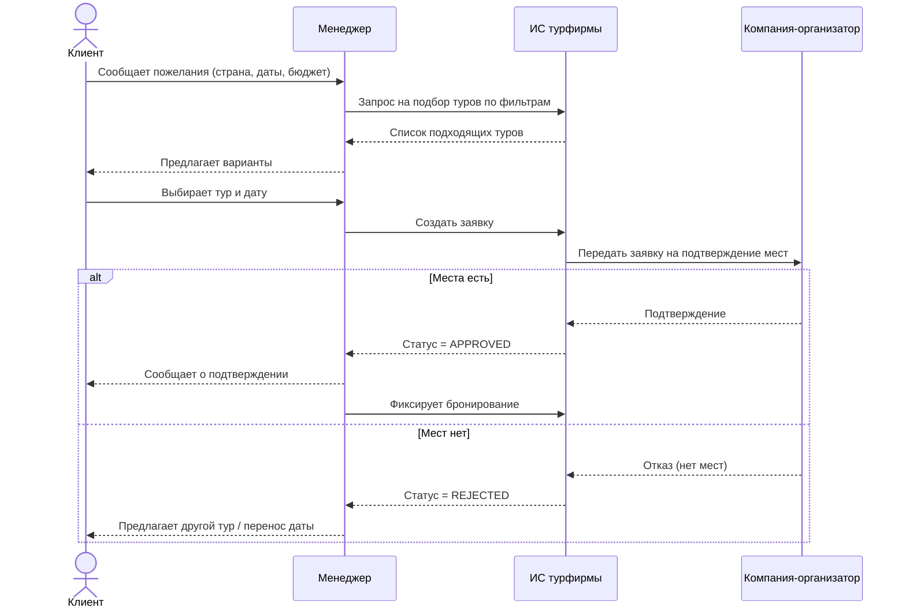

# Диаграмма последовательностей: поток «Подбор тура»

```mermaid
sequenceDiagram
    actor C as Клиент
    participant M as Менеджер
    participant A as ИС турфирмы
    participant O as Компания-организатор

    C->>M: Сообщает пожелания (страна, даты, бюджет)
    M->>A: Запрос на подбор туров по фильтрам
    A-->>M: Список подходящих туров
    M-->>C: Предлагает варианты
    C->>M: Выбирает тур и дату
    M->>A: Создать заявку
    A->>O: Передать заявку на подтверждение мест

    alt Места есть
        O-->>A: Подтверждение
        A-->>M: Статус = APPROVED
        M-->>C: Сообщает о подтверждении
        M->>A: Фиксирует бронирование
    else Мест нет
        O-->>A: Отказ (нет мест)
        A-->>M: Статус = REJECTED
        M-->>C: Предлагает другой тур / перенос даты
    end
```
