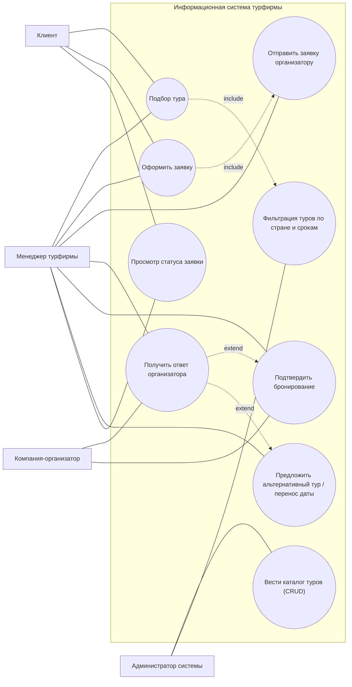

# Диаграмма вариантов использования (Use Case)

```mermaid
flowchart LR
    Client["Клиент"]
    Manager["Менеджер турфирмы"]
    Organizer["Компания-организатор"]
    Admin["Администратор системы"]

    subgraph IS["Информационная система турфирмы"]
        UC1(("Подбор тура"))
        UC2(("Оформить заявку"))
        UC3(("Отправить заявку организатору"))
        UC4(("Получить ответ организатора"))
        UC5(("Подтвердить бронирование"))
        UC6(("Предложить альтернативный тур / перенос даты"))
        UC7(("Вести каталог туров (CRUD)"))
        UC8(("Фильтрация туров по стране и срокам"))
        UC9(("Просмотр статуса заявки"))
    end

    Client --- UC1
    Client --- UC2
    Client --- UC9

    Manager --- UC1
    Manager --- UC2
    Manager --- UC3
    Manager --- UC4
    Manager --- UC5
    Manager --- UC6
    Manager --- UC9

    Organizer --- UC4
    Organizer --- UC5

    Admin --- UC7
    Admin --- UC8

    UC2 -.include.-> UC3
    UC4 -.extend.-> UC5
    UC4 -.extend.-> UC6
    UC1 -.include.-> UC8
```
